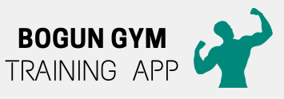
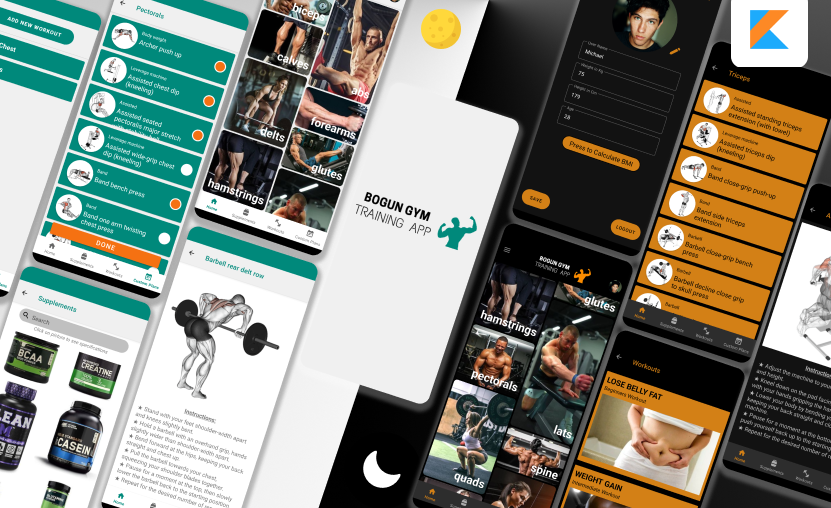

# Bogun Gym Training App

## Overview

The Bogun Gym Training App is a fitness application developed in Kotlin that allows users to access a wide range of exercises and workouts. This app is built using a variety of modern technologies and design patterns, including Gson, Moshi, Retrofit, ExercisesDB API, Firebase for user authentication and preferences, Dark Mode, Room Database, and MVVM architecture.

## Screenshots

## Installation

To set up and run the Bogun Gym Workout App, follow the steps below:

## Configuration

Before running the app, you may need to configure the following:

- API Key: Obtain an API key from ExercisesDB (or your chosen exercise data source) and set it in the `config.properties` file.

## Dependencies

This app utilizes various third-party libraries and technologies:

- [Gson](https://github.com/google/gson): For JSON serialization and deserialization.
- [Moshi](https://github.com/square/moshi): A modern JSON library for Kotlin.
- [Retrofit](https://square.github.io/retrofit/): For making network requests to the ExercisesDB API.
- [Firebase](https://firebase.google.com/): For user authentication and preferences.
- [Room Database](https://developer.android.com/training/data-storage/room): For local storage of exercise data.
- [MVVM Architecture](https://developer.android.com/jetpack/guide): To structure the app's components.

## Usage

1. Register or log in to your account using Firebase authentication.

2. Explore the exercise library to find workouts that suit your preferences and fitness goals.

3. Create custom workout plans and save them for future reference.

4. Toggle between Dark Mode and Light Mode based on your visual preference.

## Contributions

- [Momcilo Bogunovic](https://github.com/momabogun)

Contributions to the Bogun Gym Workout App are welcome! Feel free to fork the repository and submit pull requests to contribute new features, improvements, or bug fixes.

## License

This project is licensed under the MIT License - see the [LICENSE](LICENSE) file for details.

## Contact

If you have any questions or need assistance, please contact the app's developer at [Momcilo Bogunovic](https://github.com/momabogun).

Thank you for using the Bogun Gym Training App! Stay fit and healthy.

